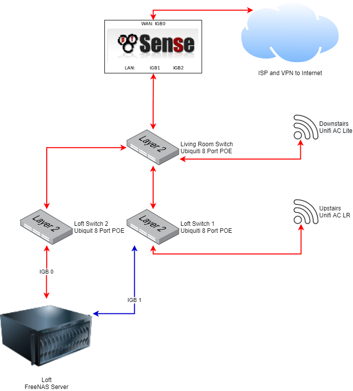

# Home Network
This repository holds the setup and documentation of my home network, I've built up my home network from guides and other free online documentation, feel free to use this as a starting point or as a source of information when your building your own home network. Building a home network is the best way to learn, and can be much cheaper than you think. It is also a really good way to teach yourself about VLANS, subnetting and network security.

## Network Diagram
This is my current network diagram, I used [draw.io](https://app.diagrams.net/) to create this network diagram.

  

## Hardware
Below is the hardware I use to run my home network, my network works great for me and my familys needs, and could probably support a small office, or home office if needed.

| Function                        | Name                       | Cost £  |
| :-------------                  |:-------------              | -----:  |
| Router/Firewall                 | [APU2 E2 2GB (3NIC+USB+RTC)](https://linitx.com/product/linitx-apu2-d2-2gb-(3nic+usb+rtc)-with-pfsense-pre-configured-kit/15317) | 180     |
| 1 x Living Room Switch              | [Unifi US-8-60W Port Switch](https://www.amazon.co.uk/Ubiquiti-US-8-60W-UniFi-Port-Switch/dp/B004BQCKXO/ref=sr_1_2?crid=2FCWM3ZES52LE&dchild=1&keywords=unifi+switch+8+60w&qid=1587243344&sprefix=unifi+switch+8%2Caps%2C218&sr=8-2) | 104     |
| 2 x Loft Room Switch                | [Unifi US-8-60W Port Switch](https://www.amazon.co.uk/Ubiquiti-US-8-60W-UniFi-Port-Switch/dp/B004BQCKXO/ref=sr_1_2?crid=2FCWM3ZES52LE&dchild=1&keywords=unifi+switch+8+60w&qid=1587243344&sprefix=unifi+switch+8%2Caps%2C218&sr=8-2) | 208     |
| Living Room Access Point        | [UAP-AC-LITE Access Point](https://www.amazon.co.uk/Ubiquiti-Networks-UAP-AC-LITE-Access-Point/dp/B016K4GQVG/ref=sr_1_2?crid=9A938FRFN4JP&dchild=1&keywords=unifi+ac+lite+ap&qid=1587243711&sprefix=unifi+ac+lite%2Caps%2C221&sr=8-2) | 80     |
| First Floor Access Point        | [UAP-AC-LR Access Point](https://www.amazon.co.uk/Ubiquiti-Networks-UAP-AC-LITE-Access-Point/dp/B016K4GQVG/ref=sr_1_2?crid=9A938FRFN4JP&dchild=1&keywords=unifi+ac+lite+ap&qid=1587243711&sprefix=unifi+ac+lite%2Caps%2C221&sr=8-2) | 97     |
| 24 Port Patch Panel             | [24 Way Keystone Patch Panel](https://www.cablemonkey.co.uk/patch-panel-frames/9504-24-way-unloaded-utp-keystone-patch-panel.html) | 30    |
| 10 x Tool-Less Keystone Modules | [Cat 6 UTP Keystone Module](https://www.cablemonkey.co.uk/cat6-modules-outlets/9503-cat6-utp-tool-less-keystone-module.html?search_query=UTP+Tool-Less+Keystone+Module&results=5) | 30   |
| Cat 6 UTP 100m | [Cat 6 UTP PVC Solid Core Cable](https://www.magicpatch.co.uk/cat6-cable/21-excel-cat6-utp-cable.html) | 36    |
| 2 x 19" Rack Mount for Unifi Switch | [SimpleNetwork for Unifi 8 Port](https://www.amazon.co.uk/gp/product/B07VHQGZ7C/ref=ppx_yo_dt_b_asin_title_o01_s00?ie=UTF8&psc=1) | 50    |
| Black Silicone RJ45 Anti Dust Cover Caps | [Black Silicone RJ45 Anti Dust Cover Caps](https://www.amazon.co.uk/gp/product/B077R8ZKZ6/ref=ppx_yo_dt_b_asin_image_o00_s00?ie=UTF8&psc=1) | 20   |

## Network Explainer

The following tries to explain link types, going forward,  you'll need to understand what a link types and port types are.

### What are the link types?

The link type can be divided into access link and trunk link.

Access link is part of only one VLAN, and normally is for end devices. Any device attached to an access link is unaware of a VLAN membership. An access-link connection can understand only standard Ethernet frames. Switches remove any VLAN information from the frame before it is sent to an access-link device.

Trunk link can carry multiple VLAN traffic and normally is used to connect switches to other switches or to routers or switches to wireless access points.

### What are the port types?

#### Access ports:
- Belongs to one VLAN.
- Usually an Untagged VLAN with the corresponding PVID (Native VLAN in Ubiquti language).
- Commonly used to connect a computer to a ports.

#### Trunk ports:
- Allow multiple VLANs through.
- Receives and sends multiple VLAN packets.
- Typically used for connection switches together or routers and switches or switches and wireless access point.

#### Hybrid ports:
- Allow multiple VLANs through.
- Receive and sends multiple VLAN packets.
- Used for connections between switches, switch to phone to computer (Devices that understand tags) see [802.1Q](https://en.wikipedia.org/wiki/IEEE_802.1Q) on more information on VLAN tagging..

You might grasp an understading of ports types in following table.

| No | Port Type  | Support Mode          | Common Use Cases       | Comments                             |
|:---|:----------:|:----------------------|:-----------------------|:--------------------------------------|
| 1  | Access     | Single Untagged VLAN  | Switch Port to Device  | Unifi name it "Native", other vendors setup Access Ports by untagging the port and setting the PVID (usually using the same VLAN ID)|
| 2  | Trunk      | Single Untagged VLAN + Multiple Tagged VLAN's | Switch to Switch, Hypervisor to Switch | VLAN 1 can be Tagged (Untagged by default) |
| 3  | Hybrid     | Support Untagged VLAN's and Tagged VLAN's | Physical Connection: IP Phone to Network Switch Port & a PC to IP Phones Switch port.| Logical Connection: Voice VLAN as Tagged & Data VLAN as Untagged & Switch port in Trunk mode | * Usually the Untagged VLAN number = Native/Default VLAN number| * Support for multi-Untagged Frames, usually require the use of protocol-based VLANs | * VLAN 1 can be Tagged (Untagged by default) |
### References

- [Here](https://nguvu.org/) is a list list of guides that I used as a starting point (well written and concise).
- What is a [PVID](https://www.megajason.com/2018/04/30/what-is-pvid/) (Port VLAN Identifier)
- [Here](https://www.youtube.com/watch?v=fFtA0IlnMVk&t=1916s) is a good primer on Trunk Port, Untagged VLAN's etc.
